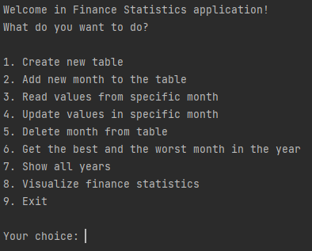
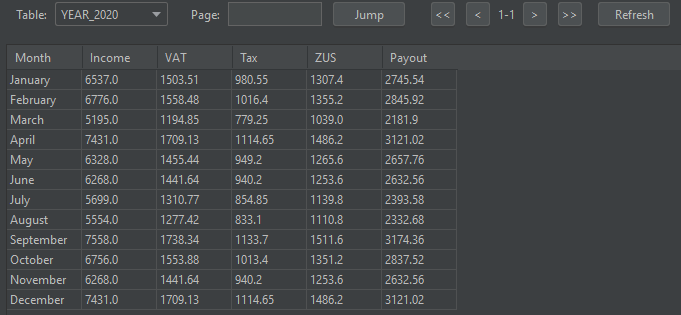
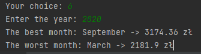
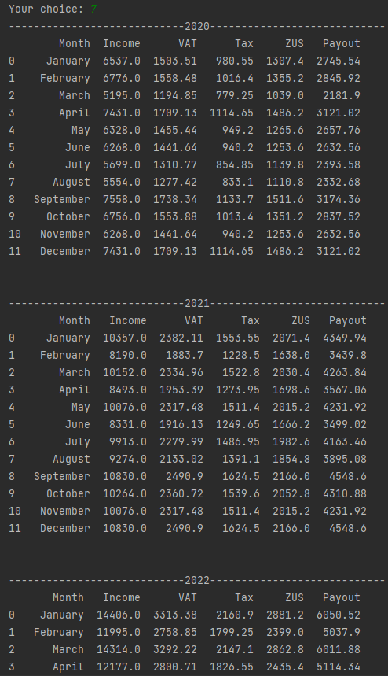
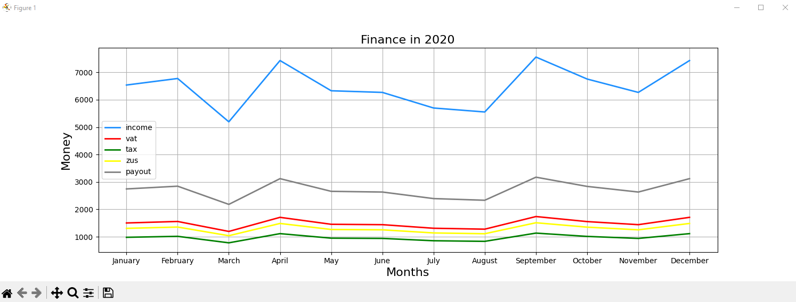
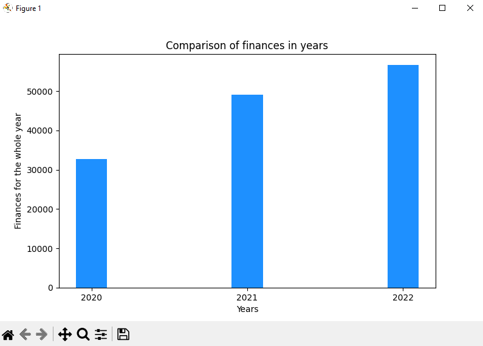

# Financial statistics

Project created as part of learning the basics of SQL. The script allows you to save, read, edit and visualize your own 
financial statistics.

## How to use:
When you run the main file, the main program menu will be shown:

1. Allows you to create a new table - the year should be the name of the table
2. Adding a new month to the table. It will be necessary to provide such data as: month name, income, VAT and tax
3. Reading data from the selected month
4. Updating any data in a selected month
5. Deletion of all data from a specific month
6. Reading the best and worst months from a given table
7. Print all data from all tables
8. Visualization of data from a specific year and visualization comparing revenues from all years
9. Close the program

## Database example:
The entered data represents the complete two years of data and the third, unfinished year.

### The table for year 2020:

### Get the best and the worst month in this year:

### Show all years:

### Visualization for year 2020 and compare all years:

